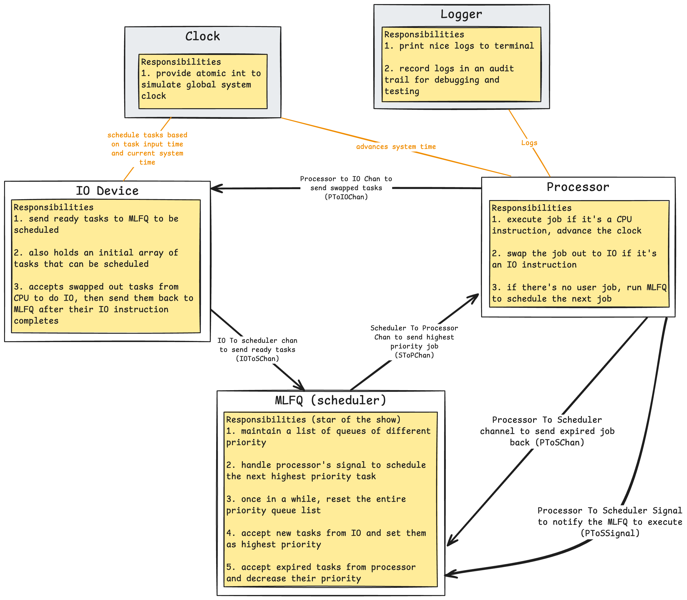

# Multi-level Feedback Queue

## To fix
1 - refactored design
2 - code time out and deadlocks when only job is at IO, IO device does not advance system time
    1.1 - for example, no task on CPU, but a task is in IO being executed, because IO is not advancing time, the task is deadlocked
    1.2 - test case: one task with IO instruction only
3 - do a comprehensive test case and validate solution
4 - write up and post on Github

## Code Design

